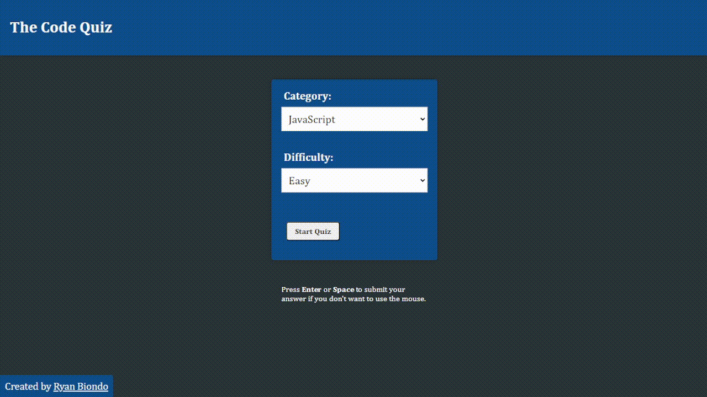

# **The Code Quiz - Server**

## **Overview**

This project is a web server that provides an API to serve quiz data to The Code Quiz client. The server is built with Node.js and Express.js, and it handles requests from our web client, and sends responses.

## **Demo**

## **Technologies Used**

- Node.js
- Express.js

## **Features**

- Hosted with Heroku

## **Project Structure**

Here is a high-level overview of the project's structure:

server
├── .gitignore
├── data
│ ├── css
│ │ ├── easy.json
│ │ ├── hard.json
│ │ └── intermediate.json
│ └── javascript
│ ├── easy.json
│ ├── hard.json
│ └── intermediate.json
├── demo.gif
├── LICENSE
├── node_modules
│ ├── ...
├── package-lock.json
├── package.json
├── procfile
├── README.md
└── server.js

## **Development Process**

_Discuss your process, challenges, and solutions here..._

## **Future Enhancements**

- User database and authorization
- High scores
- Victory images
- More quiz categories
- More questions in the pool

## **Getting Started**

To run this project locally, you'll need Node.js and npm installed. Here are the steps to get started:

1. Clone this repository: `git clone https://github.com/username/repo.git`
2. Navigate to the project folder: `cd repo`
3. Install dependencies: `npm install`
4. Start the server: `npm start`

## **Usage**

The server consists of quiz data in JSON format, and more questions can be added to the pool. Categories are separated by directory, and if a new category is added, the client will need to be updated.

## **Contributing**

We welcome contributions to this project. Please fork this repository and create a pull request with your changes.

## **License**

This project is licensed under the MIT License.

## **Acknowledgments**

- Chat-GPT4 for creating most of the questions
- Danny Thompson for inpiring me to create a more professional project
